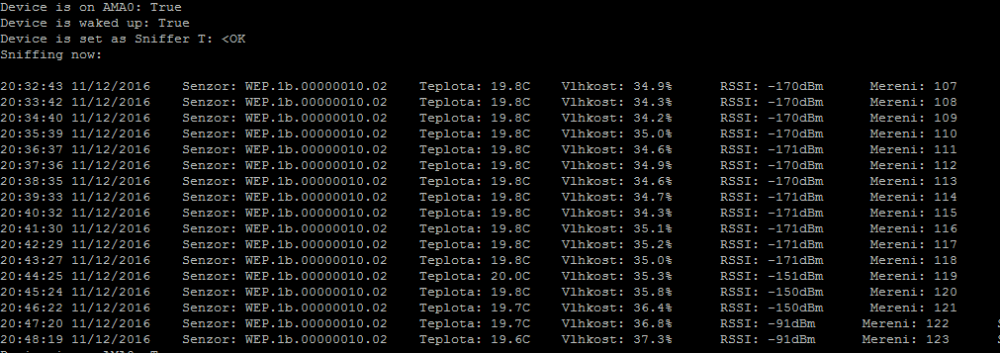

# Python script used for reading WmBUS telegrams with IQRF module implanted on UniPi module for RaspberryPi

### How to use

Skript can be run in Python interpreter:
+ General usage of the script: **python MainApplication.py**
+ Demo mode for packets from IQRF: *python MainApplication.py iqrf*
+ Demo mode for normal packets: *python MainApplication.py clean*

### Example

